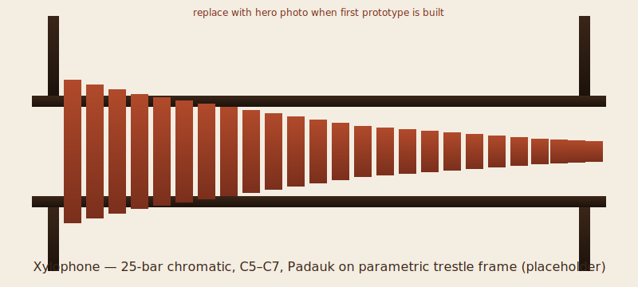

# Xylophone



A 25-bar chromatic xylophone, **C5 to C7**, in African Padauk on a
parametric trestle frame. Free-free flat-bar geometry, 12th-overtone
tuning convention, optional quarter-wave closed-pipe resonators
(deferred to v2). This repo is a v4.3 root-mode build packet from the
[`tonykoop/instrument-maker`](https://github.com/tonykoop/instrument-maker)
catalogue, designed deliberately as the *simpler sibling* of a future
`tonykoop/marimba` repo.

## Background

The xylophone is the higher-pitched cousin of the marimba: same
physics (free-free Euler-Bernoulli transverse beam vibration), harder
mallets, shorter bars, and a different second-mode tuning convention.
This packet ships the bar physics, the wood-species shortlist, the
suspension geometry, the validation workflow, and the build process
end-to-end. It deliberately *defers* the things that make a marimba
hard — the parabolic arch undercut, the mandatory tuned resonators,
the multi-octave frame — so the xylophone build is feasible in one
shop session and so the marimba follow-on can inherit a clean
scaffold rather than starting from scratch.

The root-of-truth design table is `xylophone-design-table.xlsx` at
the repo root. Every length, hole position, and resonator planning
length in `family-spec.csv` is solved from the parametric inputs
there, then held at `measurement_required` until a pilot bar is cut,
tuned, mounted, and logged.

## Design overview

- **Family:** 25 bars, C5 (523.25 Hz) through C7 (2093.00 Hz), chromatic.
- **Bar geometry:** flat-bottom rectangular, **1.500" × 0.875" cross
  section** held constant across the family. Length varies per note;
  see [`family-spec.csv`](family-spec.csv).
- **Wood:** **African Padauk** (sustainable, predictable acoustic
  properties, available in 4/4 quartersawn). Honduras Rosewood and
  Hard Maple are documented swap-ins.
- **Suspension:** 1/8" paracord through node holes drilled at 22.4%
  and 77.6% of bar length — the first free-free mode's nodes.
- **Tuning:** 12th-overtone convention noted as a *measurement
  target* on the validation sheet, not a CAD geometry. End-shaving
  is the production tuning method (no arch undercut — that's marimba).
- **Frame:** parametric 4-leg trestle, 21" wide × 30" tall, hard
  maple rails and legs with Baltic-birch corner gussets.
- **Resonators:** computed but optional. The L-per-note math is in
  `family-spec.csv` so adding resonators in v2 is additive; those
  lengths are not fabrication authority in this packet.

## Family-table preview (first and last)

| Note | Target Hz | Bar L (in) | Hole low (in) | Hole high (in) | Resonator L (in) | Mass (oz) |
|------|-----------|------------|---------------|----------------|------------------|-----------|
| C5   | 523.25    | 16.683     | 3.737         | 12.946         | 5.22             | 9.43      |
| A4 * | 440.00    | n/a        | n/a           | n/a            | n/a              | n/a       |
| A5   | 880.00    | 12.865     | 2.882         | 9.983          | 2.61             | 7.27      |
| C7   | 2093.00   | 8.342      | 1.869         | 6.473          | 0.38             | 4.71      |

\* A4 = 440 Hz is the standard tuning reference; the family ranges
from C5 upward, so A4 itself is not a member.

Full table: [`family-spec.csv`](family-spec.csv).

## Why this packet exists

This repo began as a v4.3 root-mode challenge run for the
[`instrument-maker`](https://github.com/tonykoop/instrument-maker)
skill and is now being held to the Round 31 V5 authority contract for a
wooden-idiophone build packet. Specifically:

1. Preserves the original root-mode packet shape while adding V5 readiness,
   validation-loop, and visual-authority gates.
2. Demonstrates the bar-idiophone branch of `acoustic-models.md`'s
   Free-Free Beams section with first-order honesty about K2 and
   end-correction guard rules.
3. Builds the design template that the marimba sister repo will
   inherit — every "marimba-equivalent: …" callout in
   [`design.md`](design.md) is a hook for the marimba build.

## Sister repos and references

- [`tonykoop/instrument-maker`](https://github.com/tonykoop/instrument-maker)
  — parent catalogue, the v4 skill source, references and scripts.
- [`tonykoop/tongue-drum`](https://github.com/tonykoop/tongue-drum) —
  closest sister repo: another wooden idiophone, free-free / cantilever
  beam math, SolidWorks master-layout convention, magazine-baseline
  attribution. The xylophone README borrows its structure.
- `tonykoop/marimba` *(planned)* — the natural follow-on; this
  packet's `design.md` calls out exactly what each marimba decision
  has to swap in (`Marimba-Equivalent Hooks` table).

## Repo layout

```
xylophone/
├── README.md                     ← this file
├── design.md                     ← governing model, family plan, decisions
├── family-spec.csv               ← parametric per-note table (25 rows)
├── bom.csv, sourcing.csv         ← parts and supplier candidates
├── cut-list.csv                  ← shop cut list (bars + frame)
├── validation.csv                ← measured-tuning workflow (8 rows)
├── validation-loop.csv           ← Round 31 measurement-required gates
├── visual-output-register.csv    ← visual/CAD/design-table authority register
├── drawings/per-bar-dxf-checklist.csv ← per-bar DXF release checklist
├── assembly-manual.md            ← 14-step shop manual
├── supplier-rfq.md               ← bar-stock RFQ template
├── drawing-brief.md              ← what the SVG drawings must show
├── visual-bom-brief.md           ← printable visual BOM brief
├── wolfram-starter.wl            ← parametric Wolfram source
├── risks.md                      ← red-team risk register
├── resources.md                  ← citations and references
├── jig-decision.md               ← three jig build/no-build calls
├── photo-shotlist.md             ← ten-shot photo plan
├── capstone-deck.md / .pptx      ← recruiter-facing slide deck
├── print-packet.md / .html / .pdf ← shop-printable packet
├── capstone-manifest.json        ← deck-and-packet manifest
├── xylophone-design-table.xlsx   ← parametric source of truth
├── images/                       ← hero, build photos
├── drawings/                     ← per-bar SVGs + frame elevation/plan
├── cad/                          ← SolidWorks master authority plan (master deferred)
├── cnc/                          ← cnc-plan.json + setup-sheet.md
├── jigs/                         ← jig sketches (deferred)
└── site/                         ← static build-log site
```

## Round 31 V5 Build-Packet Gate

- This PR treats the repo as a V5/L1 build-packet candidate, not a
  bench-validated or build-ready instrument.
- `xylophone-design-table.xlsx` and `family-spec.csv` are the planning
  authority for first-order bar dimensions and node-hole positions.
- `visual-output-register.csv` records that the hero placeholder and SVG
  previews are not fabrication authority.
- `validation-loop.csv` names the pilot-bar, resonator, frame/CNC, and visual
  authority gates that must close before any L2 or shop-release claim.
- Empirical/build gates remain deferred until pilot bars are cut, measured,
  tuned, mounted, and logged in `validation.csv`.

## Round 33C/D CAD/DXF Authority Gate

- `cad/solidworks-master-authority-plan.md` defines the future SolidWorks
  master-layout and extracted-dimension CSV gate; it is not CAD authority by
  itself.
- `drawings/per-bar-dxf-checklist.csv` lists all 25 bars and the per-bar DXF
  checks required before any DXF can become shop authority.
- Per-bar DXF release remains blocked until pilot-bar V2/V3 measurements exist,
  exported CAD dimensions match the reviewed table, and the released artifacts
  are recorded in `visual-output-register.csv`.

## License

[CC BY 4.0](LICENSE) — see LICENSE for details.
