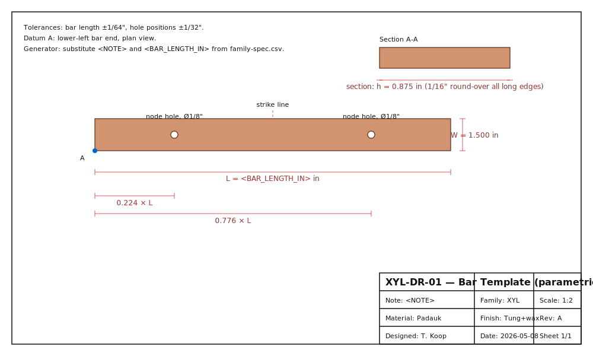

# Xylophone Capstone
- Musical instrument documentation capstone
- Build packet: xylophone
- Generated: 2026-05-08

---

# Project Intent
- Ship a parametric, validator-clean, public-readable Mode A build packet for
a serious wooden tuned-bar idiophone — small enough to build in one shop
session, honest enough about the physics that the predicted frequencies and
the measured frequencies will disagree on first cut and the workflow can
correct them, structured enough that a marimba follow-on can reuse the
family table, the validation rows, the suspension geometry, the SolidWorks
master-layout convention, and the empirical-correction guard rules.

_Speaker notes:_ Read design.md before committing to dimensions or sourcing decisions.

---

# Physics Model
- Free-free Euler-Bernoulli transverse beam vibration, first mode:

_Speaker notes:_ Governing equations extracted verbatim from design.md. Apply empirical corrections (NAF K2, scale offsets) only where the model permits — see references/acoustic-models.md.

---

# How To Use This Packet
- Start with design.md for intent and assumptions.
- Use bom.csv, sourcing.csv, and cut-list.csv before buying or cutting.
- Use drawing-brief.md and CAD/CNC folders before machining.
- Print the packet for shopping, shop work, and validation.

---

# File Map
- design.md: Project intent, catalog metadata, assumptions, and validation plan.
- bom.csv: Starter bill of materials with part categories, quantities, drawing refs, and notes.
- sourcing.csv: Supplier/search tracker with specs, price/date fields, lead time, substitutes, and risks.
- cut-list.csv: Rough/final stock sizes, material, grain/orientation, operations, yield, and offcuts.
- drawing-brief.md: Manufacturing drawing and technical product sketch brief.
- assembly-manual.md: Shop-facing sequence, tools, fixtures, safety, tuning, finishing, and maintenance notes.
- validation.csv: Target/measured values, tolerance, environment, result, and tuning/build action log.
- supplier-rfq.md: Supplier email/request-for-quote starter.

---

# Family Spec

| note | target_hz | bar_length_in | bar_width_in | bar_thickness_in | hole_pos_low_in | hole_pos_high_in | predicted_f1_hz | predicted_f1_source | wood_species | resonator_l_in_optional | mass_oz_est | notes |
| --- | --- | --- | --- | --- | --- | --- | --- | --- | --- | --- | --- | --- |
| C5 | 523.25 | 16.683 | 1.500 | 0.875 | 3.737 | 12.946 | 523.25 | free-free Euler-Bernoulli f1=1.028(h/L^2)sqrt(E/rho); first-order; Padauk E=12.6GPa rho=745kg/m3 | Padauk | 5.22 | 9.43 | solved L from target_hz |
| C#5 | 554.37 | 16.208 | 1.500 | 0.875 | 3.631 | 12.578 | 554.37 | free-free Euler-Bernoulli f1=1.028(h/L^2)sqrt(E/rho); first-order; Padauk E=12.6GPa rho=745kg/m3 | Padauk | 4.86 | 9.16 | solved L from target_hz |
| D5 | 587.33 | 15.747 | 1.500 | 0.875 | 3.527 | 12.220 | 587.33 | free-free Euler-Bernoulli f1=1.028(h/L^2)sqrt(E/rho); first-order; Padauk E=12.6GPa rho=745kg/m3 | Padauk | 4.52 | 8.90 | solved L from target_hz |
| D#5 | 622.25 | 15.299 | 1.500 | 0.875 | 3.427 | 11.872 | 622.25 | free-free Euler-Bernoulli f1=1.028(h/L^2)sqrt(E/rho); first-order; Padauk E=12.6GPa rho=745kg/m3 | Padauk | 4.20 | 8.65 | solved L from target_hz |
| E5 | 659.26 | 14.863 | 1.500 | 0.875 | 3.329 | 11.534 | 659.26 | free-free Euler-Bernoulli f1=1.028(h/L^2)sqrt(E/rho); first-order; Padauk E=12.6GPa rho=745kg/m3 | Padauk | 3.89 | 8.40 | solved L from target_hz |
| F5 | 698.46 | 14.440 | 1.500 | 0.875 | 3.235 | 11.205 | 698.46 | free-free Euler-Bernoulli f1=1.028(h/L^2)sqrt(E/rho); first-order; Padauk E=12.6GPa rho=745kg/m3 | Padauk | 3.60 | 8.16 | solved L from target_hz |
| F#5 | 739.99 | 14.029 | 1.500 | 0.875 | 3.142 | 10.886 | 739.99 | free-free Euler-Bernoulli f1=1.028(h/L^2)sqrt(E/rho); first-order; Padauk E=12.6GPa rho=745kg/m3 | Padauk | 3.33 | 7.93 | solved L from target_hz |
| G5 | 783.99 | 13.630 | 1.500 | 0.875 | 3.053 | 10.577 | 783.99 | free-free Euler-Bernoulli f1=1.028(h/L^2)sqrt(E/rho); first-order; Padauk E=12.6GPa rho=745kg/m3 | Padauk | 3.08 | 7.70 | solved L from target_hz |
| G#5 | 830.61 | 13.242 | 1.500 | 0.875 | 2.966 | 10.275 | 830.61 | free-free Euler-Bernoulli f1=1.028(h/L^2)sqrt(E/rho); first-order; Padauk E=12.6GPa rho=745kg/m3 | Padauk | 2.83 | 7.48 | solved L from target_hz |
| A5 | 880.00 | 12.865 | 1.500 | 0.875 | 2.882 | 9.983 | 880.00 | free-free Euler-Bernoulli f1=1.028(h/L^2)sqrt(E/rho); first-order; Padauk E=12.6GPa rho=745kg/m3 | Padauk | 2.61 | 7.27 | solved L from target_hz |
| A#5 | 932.33 | 12.498 | 1.500 | 0.875 | 2.800 | 9.699 | 932.33 | free-free Euler-Bernoulli f1=1.028(h/L^2)sqrt(E/rho); first-order; Padauk E=12.6GPa rho=745kg/m3 | Padauk | 2.39 | 7.06 | solved L from target_hz |
| B5 | 987.77 | 12.143 | 1.500 | 0.875 | 2.720 | 9.423 | 987.77 | free-free Euler-Bernoulli f1=1.028(h/L^2)sqrt(E/rho); first-order; Padauk E=12.6GPa rho=745kg/m3 | Padauk | 2.19 | 6.86 | solved L from target_hz |
| C6 | 1046.50 | 11.797 | 1.500 | 0.875 | 2.643 | 9.154 | 1046.50 | free-free Euler-Bernoulli f1=1.028(h/L^2)sqrt(E/rho); first-order; Padauk E=12.6GPa rho=745kg/m3 | Padauk | 2.00 | 6.67 | solved L from target_hz |
| C#6 | 1108.73 | 11.461 | 1.500 | 0.875 | 2.567 | 8.894 | 1108.73 | free-free Euler-Bernoulli f1=1.028(h/L^2)sqrt(E/rho); first-order; Padauk E=12.6GPa rho=745kg/m3 | Padauk | 1.81 | 6.48 | solved L from target_hz |
| D6 | 1174.66 | 11.135 | 1.500 | 0.875 | 2.494 | 8.641 | 1174.66 | free-free Euler-Bernoulli f1=1.028(h/L^2)sqrt(E/rho); first-order; Padauk E=12.6GPa rho=745kg/m3 | Padauk | 1.64 | 6.29 | solved L from target_hz |
| D#6 | 1244.51 | 10.818 | 1.500 | 0.875 | 2.423 | 8.395 | 1244.51 | free-free Euler-Bernoulli f1=1.028(h/L^2)sqrt(E/rho); first-order; Padauk E=12.6GPa rho=745kg/m3 | Padauk | 1.48 | 6.11 | solved L from target_hz |
| E6 | 1318.51 | 10.510 | 1.500 | 0.875 | 2.354 | 8.156 | 1318.51 | free-free Euler-Bernoulli f1=1.028(h/L^2)sqrt(E/rho); first-order; Padauk E=12.6GPa rho=745kg/m3 | Padauk | 1.33 | 5.94 | solved L from target_hz |
| F6 | 1396.91 | 10.211 | 1.500 | 0.875 | 2.287 | 7.923 | 1396.91 | free-free Euler-Bernoulli f1=1.028(h/L^2)sqrt(E/rho); first-order; Padauk E=12.6GPa rho=745kg/m3 | Padauk | 1.19 | 5.77 | solved L from target_hz |
| F#6 | 1479.98 | 9.920 | 1.500 | 0.875 | 2.222 | 7.698 | 1479.98 | free-free Euler-Bernoulli f1=1.028(h/L^2)sqrt(E/rho); first-order; Padauk E=12.6GPa rho=745kg/m3 | Padauk | 1.05 | 5.61 | solved L from target_hz |
| G6 | 1567.98 | 9.638 | 1.500 | 0.875 | 2.159 | 7.479 | 1567.98 | free-free Euler-Bernoulli f1=1.028(h/L^2)sqrt(E/rho); first-order; Padauk E=12.6GPa rho=745kg/m3 | Padauk | 0.92 | 5.45 | solved L from target_hz |
| G#6 | 1661.22 | 9.363 | 1.500 | 0.875 | 2.097 | 7.266 | 1661.22 | free-free Euler-Bernoulli f1=1.028(h/L^2)sqrt(E/rho); first-order; Padauk E=12.6GPa rho=745kg/m3 | Padauk | 0.80 | 5.29 | solved L from target_hz |
| A6 | 1760.00 | 9.097 | 1.500 | 0.875 | 2.038 | 7.059 | 1760.00 | free-free Euler-Bernoulli f1=1.028(h/L^2)sqrt(E/rho); first-order; Padauk E=12.6GPa rho=745kg/m3 | Padauk | 0.69 | 5.14 | solved L from target_hz |
| A#6 | 1864.66 | 8.838 | 1.500 | 0.875 | 1.980 | 6.858 | 1864.66 | free-free Euler-Bernoulli f1=1.028(h/L^2)sqrt(E/rho); first-order; Padauk E=12.6GPa rho=745kg/m3 | Padauk | 0.58 | 5.00 | solved L from target_hz |
| B6 | 1975.53 | 8.586 | 1.500 | 0.875 | 1.923 | 6.663 | 1975.53 | free-free Euler-Bernoulli f1=1.028(h/L^2)sqrt(E/rho); first-order; Padauk E=12.6GPa rho=745kg/m3 | Padauk | 0.48 | 4.85 | solved L from target_hz |
| C7 | 2093.00 | 8.342 | 1.500 | 0.875 | 1.869 | 6.473 | 2093.00 | free-free Euler-Bernoulli f1=1.028(h/L^2)sqrt(E/rho); first-order; Padauk E=12.6GPa rho=745kg/m3 | Padauk | 0.38 | 4.71 | solved L from target_hz |

_Speaker notes:_ Sizes scale via the master scale factor; tuning targets are first-order Helmholtz/cantilever predictions to be empirically corrected per prototype.

---

# Build Workflow
- Design and assumptions
- Source materials and hardware
- Prepare stock, fixtures, and CNC/laser/lathe setup
- Assemble, tune, finish, and validate

---

# Sourcing And BOM
- BOM gives part categories and drawing references.
- Sourcing tracks search terms, supplier candidates, price/date, lead time, substitutions.
- Visual BOM brief turns the parts list into a presentation-ready image board.

---

# Shop Packet
- Cut list for lumber/sheet/blank planning.
- Assembly manual for away-from-keyboard work.
- Validation sheet for measured dimensions, tuning, pass/fail checks.

---

# Drawings, CAD, CNC
- drawing-brief.md defines required views, dimensions, datums, sketch intent.
- cad/ holds models and design tables.
- cnc/ holds CAM, toolpaths, setup sheets, dry-run notes.
- drawings/ holds PDFs, SVGs, DXFs, drawing exports.

---

# Images And Screenshots
- images/xylophone-hero-placeholder.svg

---

# Validation Plan
- A4 = 440 Hz reference check.
- Tuning targets logged in validation.csv.
- Critical dimensions verified against design sheet and CAD.
- Photos and revision notes after each major step.

---

# Open Risks / Decisions
- TBDs in design sheet and BOM.
- Supplier price/availability not yet verified.
- Generated images marked as concept placeholders.
- Empirical corrections await measured prototype data.

---

# Next Actions
- Replace TBDs with measured/source-backed values.
- Verify live supplier price and availability before buying.
- Export final drawings and visual BOM images.
- Regenerate this deck and print packet after final edits.

---
